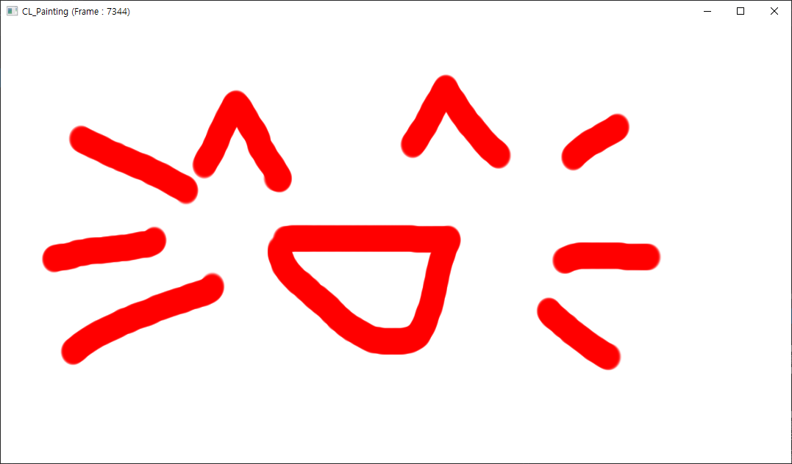

# CLPainting

Simple mouse painting using OpenCL and GL.

## Environments

* OpenGL 3.2+
* OpenCL 1.2
* Windows 7 or higher
* Visual Studio 2017 or higher

## Prerequisites

* GLEW library required. You need to copy binaries (bin/include/lib) into project's glew folder.
* You need the OpenCL SDK like CUDA Computing tookit or AMD APP SDK. I've tested with CUDA 10.1 and APP SDK 3.0.